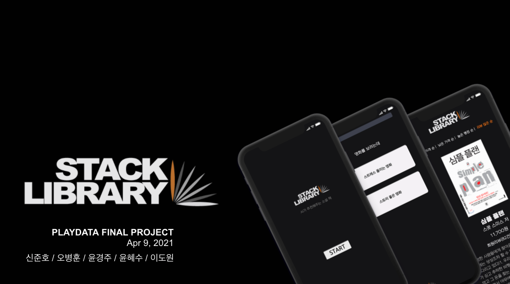

# PLAYDATA FINAL PROJCET - STACK LIBRARY

## Introduction

STACK LIBRARY는 [Playdata](https://playdata.io/)에서 진행한 최종 팀프로젝트입니다. Tf-idf와 코사인 유사도를 사용한 컨텐츠 기반 필터링 방법을 이용한 소설 추천 서비스를 주제로 프로젝트를 진행했습니다.

 

## Contributor

- [신준호](https://github.com/ggwnsghgg)
- [오병훈](https://github.com/OHBEYOUNGHUN)
- [윤경주](https://github.com/GraceYoon281)
- [윤혜수](https://github.com/YHS20)
- [이도원](https://github.com/2dowon)

 

## Period

2021.3.15 ~ 2021.4.09

 

## Stack

      

- Programming Language : Python 3.7.3
- WEB : HTML, CSS, JavaScript, Flask 1.1.2
- IDE
  - Google Colab
  - Visual Studio Code 1.43.2
- DataBase : MySQL 8.0.22
- Deployment : AWS

 

## Presentation
- [STACK LIBRARY 발표 PPT](https://docs.google.com/presentation/d/1g30tSwl_EkIWgpgB-zVQ1RZYFgaF4kEOq8OuQsbZXlE/edit?usp=sharing)
- [STACK LIBRARY 시연 영상](https://youtu.be/VAnimJpj30o)
